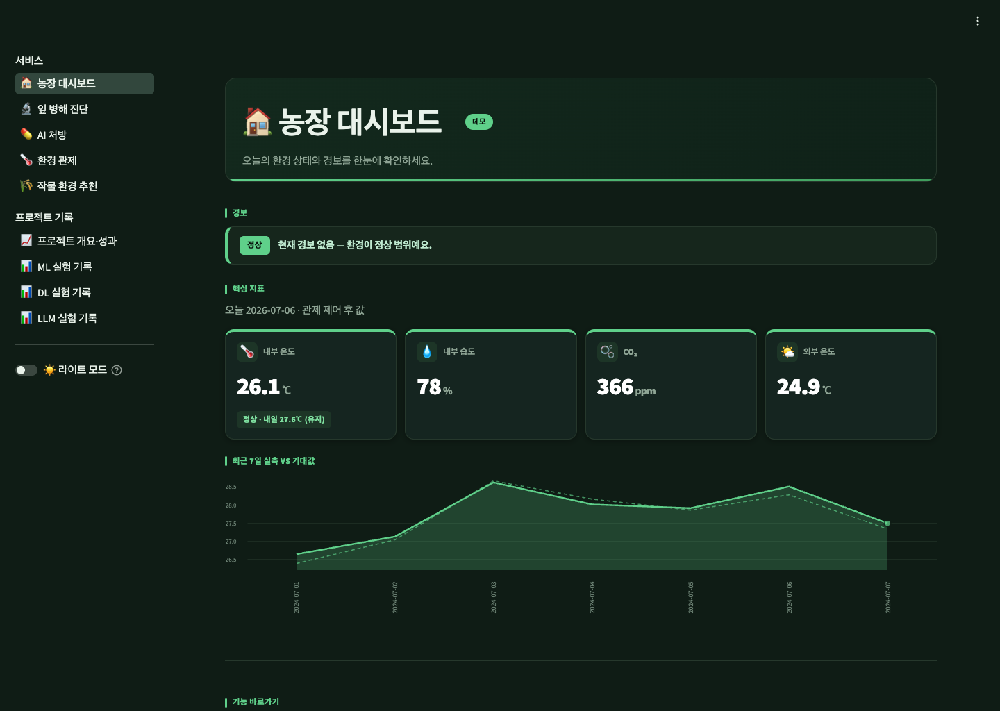
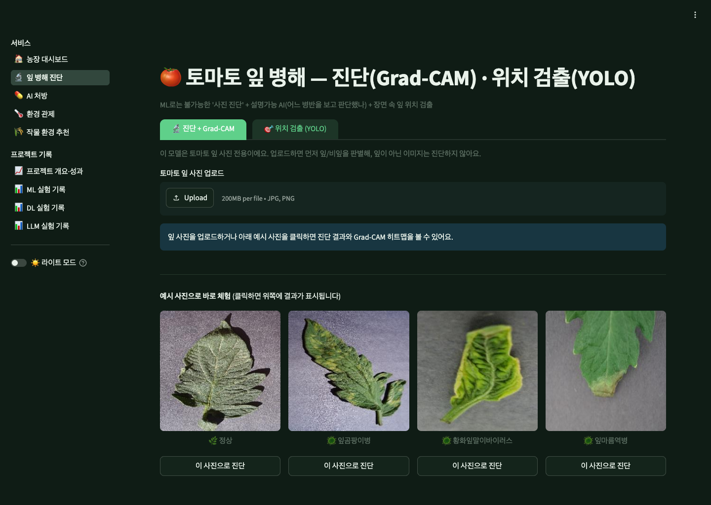
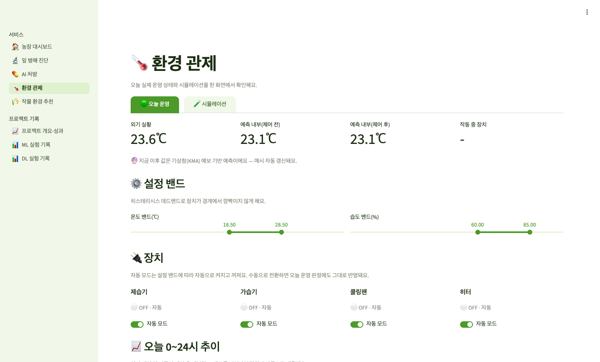
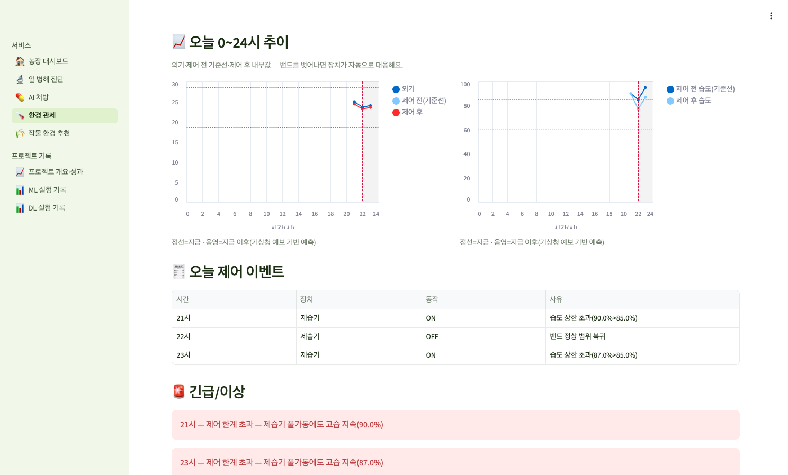

# 🌱 SmartFarm AI — 작물 재배 도우미 (ML → DL → LLM)

> **센서는 환경 숫자를 보여주지만, 이 AI는 작물에 뭘 해줘야 할지를 알려준다.**
> 스마트팜 환경·잎 사진을 받아 **작물 분류 → 잎 병해충 진단 → 자연어 처방**까지 가는 멀티모달 AI.
> 작물 **토마토 단일로 시작 → 전이학습으로 다작물 확장** (딸기·오이·참외…).

[](https://www.python.org/)


[](https://smartfarm-ai.luma200ok.com)

> 🚀 **통합 라이브 데모 (ML·DL·LLM 한 페이지):** **https://smartfarm-ai.luma200ok.com**



| 🔬 잎 병해 진단 (Grad-CAM·YOLO) | 🌡️ 환경 관제 (밴드 자동제어·경보) |
|---|---|
|  |  |

📄 **수행내역서 (단계별 상세 보고서):**
- [① Phase 1 · ML — 환경 → 작물 분류](docs/phase1_ml.md)
- [② Phase 2 · DL — 잎 병해 진단 + 환경 시계열](docs/phase2_dl.md)
- [③ Phase 3 · LLM — 자연어 처방](docs/phase3_llm.md)

---

## 📌 진행 단계 (한눈 요약)

| Phase | 내용 | 기술 | 핵심 성과 | 상태 |
|---|---|---|---|---|
| **1. ML** | 환경 센서 → 작물 9종 분류 (2022~24 다년) | RandomForest·XGBoost | test F1 0.68 · **GKF 0.49**(누수 교훈) | ✅ 완료 |
| **2. DL** | 잎 사진 진단(CNN·YOLO) + 환경 시계열(LSTM) | PyTorch·전이학습·Grad-CAM·MLflow | 진단 4분류 acc **0.96** · YOLO 0.78 · LSTM 1.18℃ | ✅ 완료 |
| **3. LLM** | 진단+환경 → 자연어 처방·코치·경보·관제 | Ollama(qwen2.5:14b·writer exaone3.5:2.4b)·function calling·RAG(bge-m3)·규칙 관제·디스코드 | **근거 인용** 처방·처방 **fast-path -95%**·**중앙 유지형** 관제·자동 경보 | ✅ 완료 |

> 아래 **Phase별 블록을 하나씩 펼쳐** 핵심 성과·그림·상세를 확인하세요.
> 문서: [PRD](docs/prd.md) · [로드맵](docs/roadmap.md) · [설계 결정(ADR)](docs/decisions.md)

---

## 🌱 Phase 1 (ML) — 환경 기반 작물 분류

<details>
<summary><b>📊 핵심 성과 · 그림 · 상세 — 펼쳐보기</b></summary>

농진청 스마트팜 현장 농가 데이터(**2022~2024 다년 결합**)로 **환경 센서 → 작물 9종 분류**.

- 🏆 **XGBoost 베스트** — test F1 **0.68** · 정직한 일반화 **GroupKFold F1 0.49**
- 🔑 **데이터 누수 실증** — 랜덤 분리 F1 **0.67** vs 농가 단위(GroupKFold) **0.49** → 같은 농가가 train·test에 섞이면 성능 과대평가. 진짜 성능은 0.49.
- 📈 **데이터 양 효과** — 단년→다년(3.5배)으로 공통 8작물 F1 **+0.073**, 누수 격차 36%p→18%p 완화, 수박 신규 커버.


**상세**
- 288만 시간별 → **116,365 일별 집계**, 9작물(완숙·방울토마토·딸기·오이·참외·파프리카·가지·국화·수박)
- **평가 3겹:** Test F1 0.68 · StratifiedKFold 0.67(낙관적) · **GroupKFold 0.49**(현실적 — 처음 보는 농가)
- 트리 부스팅(XGBoost·RF)이 선형(로지스틱 0.33) 대비 압도 → 환경↔작물은 **비선형**
- 데이터 양 효과(작물별 recall): 방울토마토 +0.24 · 오이 +0.18 · 가지 +0.14, 수박은 단년엔 불가 → 다년 신규 커버
- 한계: 환경은 농가가 **제어하는 값**이라 작물 고유 신호가 약함 → 새 농가 일반화(0.49)는 본질적 난제

🚀 [통합 앱 → «작물 환경 추천»·«ML 실험 기록»](https://smartfarm-ai.luma200ok.com/crops) · 📄 [수행내역서](docs/phase1_ml.md) · 🔧 [트러블슈팅(ML)](docs/troubleshooting/troubleshooting.md#ml)

</details>

---

## 🍃 Phase 2 (DL) — 잎 병해 진단 + 환경 시계열

<details>
<summary><b>📊 핵심 성과 · 그림 · 상세 — 펼쳐보기</b></summary>

토마토 잎 사진 → **4분류 진단(CNN)** + **병해 잎 위치 검출(YOLO)** + 환경 **시계열 예측(LSTM)**. ML이 못 하던 **이미지·순서** 모달리티를 더하고 설명가능 AI까지.

- 🏆 **전이학습 4분류**(정상·잎곰팡이병·황화잎말이·잎마름역병) — 서빙 ResNet18 **acc 0.96 · ROC-AUC 0.997** (백본 best mobilenet_v2 0.976, **MLflow** 추적). 잎마름역병은 AI Hub 071에 없어 **PlantVillage(CC0)** 혼합으로 확보
- 🔍 **Grad-CAM** 판단 근거 시각화(+한계 직시) + **YOLOv8n** 위치 검출 **mAP@50 0.78** — "진단 → 근거 → 위치"
- 🛡️ **2단 게이트** — 식물(plant_score<0.04) + **부위 분류기(acc 0.932)** 로 과육·비잎 입력 오진 차단
- 📉 **다변량 LSTM** — 환경 8변수·485개 다년 시계열로 baseline(1.25℃) 추월 → **MAE 1.18℃**


**상세**
- 🔑 **데이터 정제(핵심):** AI Hub 071 정상 원천에 과실·꽃·줄기 혼재 → 부위 라벨로 **잎(area=3)만 선별** + 질병 Train 확보(정상 1,330·질병 2,616) → 정확도 0.94→0.97~0.99
- **평가 심화:** 3×3 혼동행렬(병종 혼동 적음) · **FN 6건** · 불균형 가중치(질병 recall 0.86/0.93 → 0.96/0.98)
- **검출:** YOLOv8n 3클래스 전이학습(mAP@50 0.78) · **시계열:** 단년 1.22 → 다년 1.18℃(데이터 양 효과 재현)

🚀 [통합 앱 → «잎 병해 진단»·«DL 실험 기록»](https://smartfarm-ai.luma200ok.com/diagnosis) · 📄 [수행내역서](docs/phase2_dl.md) · 🔧 [트러블슈팅(DL)](docs/troubleshooting/troubleshooting.md#dl)

</details>

---

## 💬 Phase 3 (LLM) — 자연어 처방·코치·경보·알림 (✅ 완료)

<details>
<summary><b>📊 핵심 성과 · 그림 · 상세 — 펼쳐보기</b></summary>

CNN 진단 + LSTM 예측 + 재배가이드(RAG) → **LLM 자연어 처방·코치·경보**. 숫자·라벨을 사람이 읽는 "처방"으로. **진단은 ML/DL, 설명·처방은 LLM**(분업 — 환각 위험 차단). LLM은 로컬 Ollama(비용 0·오프라인).

- 🏆 **function calling + RAG 처방** — 진단·검출·예측을 tool로 호출 → **근거 출처 인용**(bge-m3) 자연어 처방. **환각 방어 3종**(신뢰도 톤 분기·게이트 차단 안내·클래스 한정성).
- ⚡ **처방 fast-path** — tool 라운드 제거·writer 모델 분리로 **서버 342.6s→16.2s(-95%)** · 로컬 웜 28→17~19s(-35%). 근거 주입·환각 방어는 그대로 유지.
- 🌡️ **환경 관제(규칙 기반)** — 오늘 운영 모드: KMA 예보 → 기대값 회귀 기준선 → 장치 4종(제습기·가습기·쿨링팬·히터) **중앙 유지형 P-제어**(여름 71%·겨울 69% 수렴).
- 🔔 **자동 감시·경보** — systemd 매시 상주 감시, **레벨 전이 시만** 디스코드 발송(dedup) — 현재🚨긴급·미래🔮사전 경보·과거 미발송.



**상세**
- **역할별 모델 분리:** 로컬 처방·agentic Q&A=`qwen2.5:14b` / 서버 처방 writer=`exaone3.5:2.4b`(1-call 전용) / 서버 tool calling=`qwen2.5:7b`. exaone의 약한 function calling을 fast-path로 무효화.
- **RAG 코퍼스:** 병해(`잎곰팡이병`·`잎마름역병`)는 **NCPMS OpenAPI 실데이터**, TYLCV·일반재배는 검수 수기. `RAG_BACKEND=pgvector`면 처방·경보 이력을 PG에 저장(기본 memory=npz).
- **날씨 인지(이슈 #6):** 외기→정상 내부 기대값 회귀(XGB **GKF-MAE 1.11℃**)로 **원인 구분 경보**(외기 요인 vs 설비 고장) + **feedforward 사전 경보**(KMA 예보→내일 내부 최저).
- **오늘 차트:** 실행(빨강 실선)·계획(회색 점선) 색 분리 · 과거=매시 스냅샷 누적, 미래=예보 합성으로 0~24시 연속.

**🎯 예시 처방:** 🔬 잎곰팡이병 의심 → 감염 잎 제거·습도↓ · 📖 근거: 농사로/NCPMS · 🌡️ 다음날 고습 예측 → 야간 환기

🚀 [통합 앱 → «AI 처방»·«환경 관제»·«LLM 실험 기록»](https://smartfarm-ai.luma200ok.com/prescribe) · 📄 [수행내역서](docs/phase3_llm.md) · 🔧 [트러블슈팅(LLM)](docs/troubleshooting/troubleshooting.md#llm)

</details>

---

## 🗂️ 구조 · 데이터 · 실행

<details>
<summary><b>📁 디렉터리 구조</b></summary>

```
smartfarm-ai/
├── src/ml/        preprocess · train · train_expect(기대값 회귀)          (Phase 1)
├── src/dl/        01_basics ~ 05_detect · prepare_tomato                  (Phase 2 — CNN·YOLO·LSTM)
├── src/llm/       prescribe · pipeline · rag/ · tools · weather · monitor · notify  (Phase 3 — 처방·RAG·알림)
├── src/control/   controller · actuators · setpoints · live               (Phase 3 — 규칙 기반 환경 관제)
├── src/sim/       가상 센서 스트림 (오늘 운영·리플레이)
├── app/           streamlit_app.py + views/(dashboard·diagnosis·prescribe·monitor·crops·about·ml_eval·dl_eval·llm_eval)  (Streamlit 멀티페이지, OCI 배포)
├── data/          데이터 (git 제외 — 포털에서 재다운)
├── models/        학습 모델 (.pt·.pkl — git 제외, rsync 배포)
└── docs/          PRD · 로드맵 · ADR · Phase 수행내역서 · 그림 · 트러블슈팅
```

</details>

<details>
<summary><b>📊 데이터 출처</b></summary>

- **ML:** [농촌진흥청 스마트팜 현장 농가 데이터](https://www.data.go.kr/data/15108734/fileData.do) (공공데이터포털)
- **DL:** [AI Hub 「시설작물 질병진단」(071)](https://aihub.or.kr/aihubdata/data/view.do?dataSetSn=153) · PlantVillage(CC0)
- **LLM(RAG·날씨):** 농사로/NCPMS 재배·방제 가이드(OpenAPI, KOGL 제2유형) · 기상청 단기예보(공공데이터포털)
- 데이터는 용량이 커서 git에 포함하지 않음 (위 출처에서 재다운로드) · 상세 → [data_sources.md](docs/data_sources.md)

</details>

<details>
<summary><b>🔧 실행</b></summary>

```bash
uv venv && uv pip install -r requirements.txt
python src/ml/preprocess.py    # 환경 데이터 → 일별 집계
python src/ml/train.py         # ML 모델 학습·평가·저장
streamlit run app/streamlit_app.py   # 통합 데모(농장 대시보드 + 서비스 5종 + 프로젝트 기록 3종)
```

</details>

---

## 🔧 트러블슈팅

프로젝트 진행 중 실제로 막힌 문제 → 원인 → 해결 기록 (한 파일, 파트별 바로가기):
[**ML**](docs/troubleshooting/troubleshooting.md#ml) · [**DL**](docs/troubleshooting/troubleshooting.md#dl) · [**배포·OCI**](docs/troubleshooting/troubleshooting.md#deploy) · [**LLM**](docs/troubleshooting/troubleshooting.md#llm)

---

## 🌿 관련 레포

- **[smartfarm_ml_learn](https://github.com/luma200ok/smartfarm_ml_learn)** — ML 입문 단계(노지 작물 추천, Kaggle Crop Recommendation). 이 프로젝트의 **출발점(v1)**으로, 범용 ML 학습 후 본 레포에서 스마트팜에 특화. (→ [ADR-001](docs/decisions.md))

---

© 2026 luma200ok(정재봉). 학습·포트폴리오 목적 프로젝트.
