# 📄 AI개발 수행내역서 — Phase 2 (DL)

> 잎 **사진으로 토마토 병해를 3분류 진단(CNN)** 하고, 병해 잎 **위치를 검출(YOLO)**, **환경 시계열을 예측(LSTM)** 하는 딥러닝 모델 개발.
> ML이 못 하던 **이미지·순서** 모달리티를 추가해, 설명가능 AI(Grad-CAM)까지 붙인 2단계.
> ← [phase1_ml.md](phase1_ml.md) · [설계 결정 ADR](decisions.md) · [README 허브](../README.md) · 다음 → [phase3_llm.md](phase3_llm.md)

| 항목 | 내용 |
|---|---|
| 과제 | ① 잎 사진 → **3분류 진단(CNN)**: 정상·잎곰팡이병·황화잎말이바이러스 ② **병해 잎 위치 검출(YOLO)** ③ 환경 시계열 → 다음날 내부온도 **예측(LSTM)** |
| 데이터 | 비전: AI Hub 「시설작물 질병진단(071)」 토마토 잎(정상/병2종) / 시계열: 농진청 환경 일별 8변수 |
| 프레임워크 | **PyTorch (Apple MPS 가속)** · 검출 `ultralytics` YOLOv8 |
| 베스트 모델 | 분류 전이학습 **ResNet18·MobileNet V2 (3분류 val acc 0.94)** / 검출 **YOLOv8n (mAP@50 0.78)** |
| 핵심 차별화 | **Grad-CAM** 판단 근거 설명 + **YOLO** 위치 검출 + **다변량 LSTM**(baseline 초과) |
| 코드 | `src/dl/` (STEP 1~5) · 🚀 데모 `app/phase2_dl.py` (진단+Grad-CAM · YOLO 검출 2탭) |

---

## 1. 사업과제
- ML(Phase 1)이 한 일은 **정형 환경 데이터 → 작물 분류**였다. 그러나 **잎의 병해는 정형 데이터로 불가능** → 사진(이미지)을 읽는 **CNN이 반드시 필요**하다. 이것이 본 프로젝트에서 DL을 도입하는 핵심 명분이다. (→ [ADR-005](decisions.md))
- 동시에 환경값은 "현재 한 시점"이 아니라 **시간의 흐름**으로 봐야 의미가 있다 → 순서를 기억하는 **LSTM**으로 추세를 예측한다.
- 작물은 Phase 1과 동일하게 **토마토 단일로 시작 → 다작물 확장** 구조를 유지한다. (→ [ADR-002](decisions.md))

## 2. 개요 및 현황
### 2.1 추진배경 및 목적
- 스마트팜 현장에서 가장 가치 있는 자동화는 **병해 조기 발견**이다. 사람이 잎을 일일이 보기 어려운 규모에서 **사진 1장 → 진단 + 근거 히트맵**을 제공하는 것이 목표.
- 단순 정확도 숫자를 넘어 **모델이 무엇을 보고 판단했는지(설명가능성)** 와 **무엇을 어떻게 틀리는지(FN 분석)** 까지 갖춘 실전형 파이프라인을 지향한다.

### 2.2 과제 범위
- **비전 분류(CNN):** 토마토 잎 사진 → **3분류**(정상·잎곰팡이병·황화잎말이바이러스). 전이학습으로 여러 백본 비교 후 베스트 선정 + Grad-CAM 설명.
- **비전 검출(YOLO):** 장면 속 **병해 잎의 위치(바운딩박스) + 병종 라벨** 검출 — 분류가 못 하는 "어디에" 를 더한다.
- **시계열(LSTM):** 환경 **8변수** × **485개 시계열**(2022~24 다년 결합) 통합 학습 → 다음날 내부온도 예측(회귀), persistence baseline 대비.
- **강건화·평가:** 클래스 불균형 대응(클래스 가중치) + 3×3 혼동행렬·ROC/AUC·오분류(FN) 분석.
- **배포:** 모델 `.pt` 저장 → Streamlit 웹 데모(진단+Grad-CAM · YOLO 검출 2탭).

### 2.3 과제 추진 방법 (ML 5스텝처럼 DL도 4스텝 + 검출 고급)
| STEP | 파일 | 내용 |
|---|---|---|
| **1 · 기초** | `src/dl/01_basics.py` | 뉴런·활성화·역전파·DataLoader를 **손계산 대조**로 원리 증명 |
| **2 · 핵심** | `src/dl/02_core.py` | CNN 기초 → 전이학습(백본 비교) → Grad-CAM → LSTM |
| **3 · 평가** | `src/dl/03_eval.py` | 불균형 대응(클래스 가중치) → 혼동행렬·ROC/AUC·FN 분석 |
| **4 · 데모** | `src/dl/04_demo.py` · `app/phase2_dl.py` | `.pt` 저장 → 추론 파이프라인 → Streamlit |
| **5 · 검출(고급)** | `src/dl/05_detect.py` | YOLO 병해 잎 위치 검출 — 비전 파트의 마지막 두께 |

> `2-N` = 불변 청크 ID(묶음 = STEP). 상세 청크 기록은 `_local/concepts/DL_devlog.md`, 이론은 `DL.md`.

## 3. 데이터
### 3.1 비전 — 토마토 잎 (AI Hub 「시설작물 질병진단」 071)
- 국내 시설작물 질병진단 데이터셋의 **토마토 잎** 사진. 라벨 JSON의 `disease` 코드로 **질병이 2종**임을 확인 → 정상 포함 **3분류**로 사용:
  - `normal`(정상) · `leaf_mold`(잎곰팡이병, 코드 18) · `tylcv`(황화잎말이바이러스, 코드 19).
- 전처리(`prepare_tomato.py`): 원천 이미지를 라벨 JSON과 짝지어 **병종 코드로 라우팅**, **train/val 겹치지 않게 분할**(누수 방지) → 256px → `ImageFolder` 저장.

| split | normal | leaf_mold(18) | tylcv(19) |
|---|---|---|---|
| train | 120 | 88 | 108 |
| val | 30 | 22 | 28 |

- 학습 입력은 224×224 + ImageNet 정규화. 질병 2종이 정상보다 적어 **불균형 존재** → STEP 3에서 정면으로 다룸.

### 3.2 시계열 — 환경 일별 8변수 (다중 시계열)
- Phase 1 전처리 산출물 `data/processed/env_daily.csv`(**2022~24 다년 결합**) 재사용. **환경 8변수**(내부온도 평균·최저·최고·표준편차, 습도, CO₂, 외부온도, 일사량)를 입력으로, **다음날 내부온도**를 예측.
- 단일 시계열이 아니라 **농가·작기·품목별 485개 시계열을 모두 학습**. 각 시계열을 **시간순 80/20 분할**(셔플 금지 → 농가 누수 차단).

### 3.3 데이터 탐색 (EDA)


- **클래스 분포:** 확보 가능한 토마토 원천 이미지가 **정상 4,423 vs 질병 246**(잎곰팡이 110·황화잎말이 136) — 약 **18:1 불균형**. STEP 3(불균형 대응)의 근거.
- **샘플 잎:** 정상·잎곰팡이병·황화잎말이 각 1장 — 병징의 시각 차이 확인.
- **환경 시계열:** 대표 농가의 내부온도는 온실 제어로 안정(20~28℃), 외부온도는 계절 변동(겨울 -5℃까지) — "제어된 값"의 특성. 내부온도 분포는 18~22℃에 집중.

## 4. STEP 1 — 신경망 기초 (원리 증명)
> PyTorch가 뒤에서 무엇을 하는지 **손계산과 대조**해 한 번 믿고 넘어가는 구간. STEP 2부터는 믿고 실전 코드를 쓴다.

### 4.1 뉴런·활성화 — "활성화 없으면 직선" (2-1)
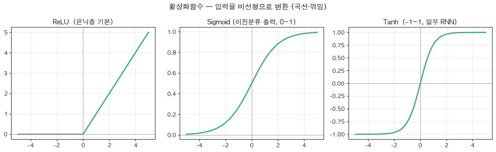
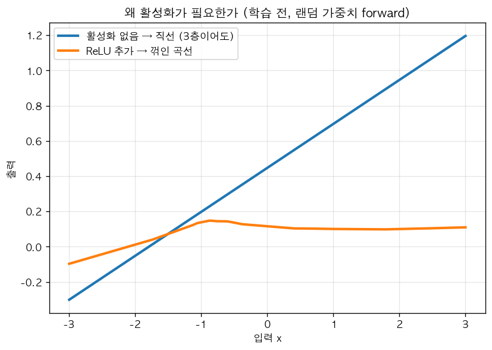

활성화(ReLU 등)가 없으면 층을 아무리 쌓아도 결국 하나의 **직선(선형)** 으로 붕괴한다. 비선형 활성화가 있어야 곡선 경계를 학습할 수 있음을 시각으로 확인.

### 4.2 학습 메커니즘 — 손실·역전파·Adam (2-2)
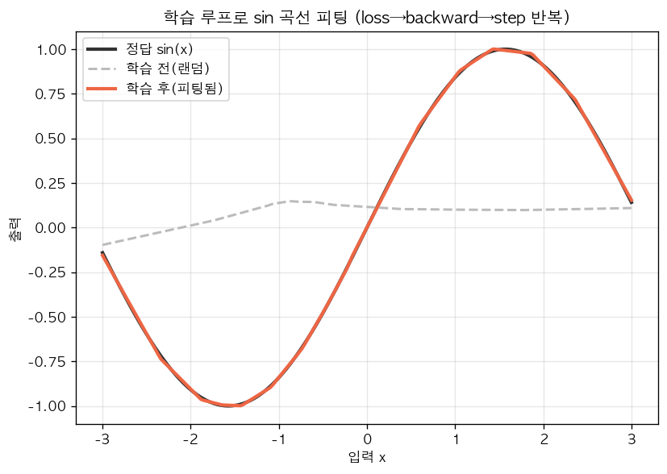
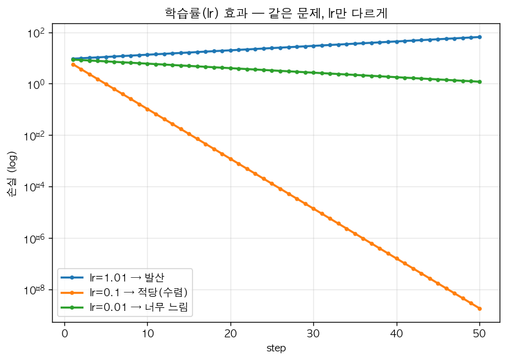

`loss → backward → step` 5단계 루프로 sin 곡선을 적합. 학습률이 너무 크면 발산, 너무 작으면 느린 수렴 — 학습률이 결과를 좌우함을 실증.

### 4.3 Dataset/DataLoader · batch 학습 (2-3)
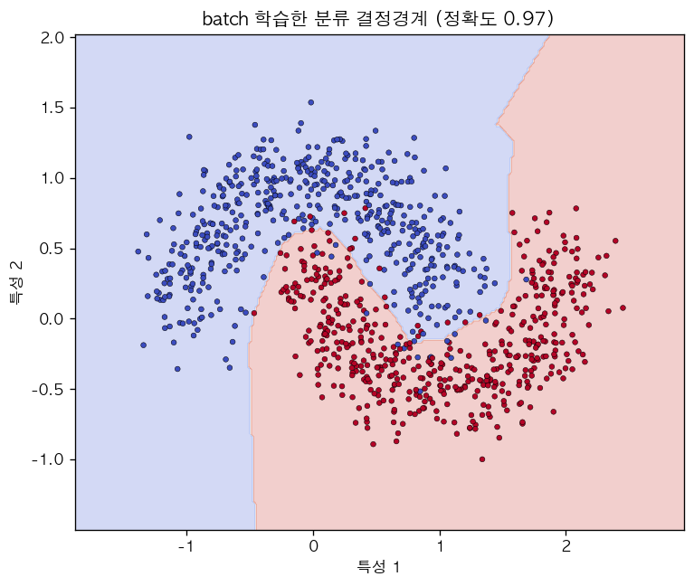
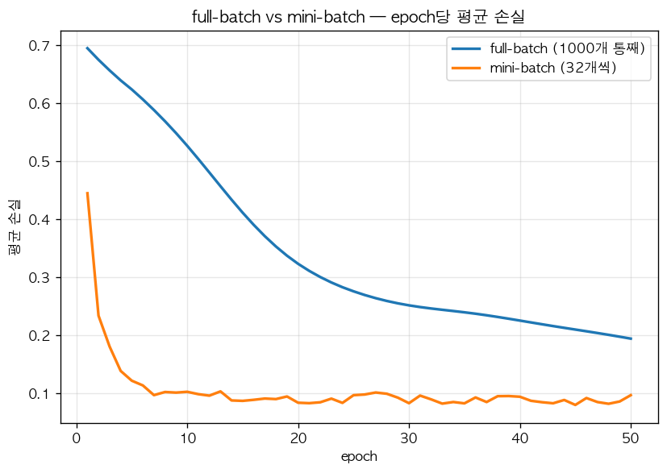

`make_moons` 2클래스에서 결정경계가 **곡선(태극)** 으로 학습됨 = ReLU(비선형)의 눈 확인. mini-batch vs full-batch 학습 곡선을 비교해 batch 학습 골격을 완성.

## 5. STEP 2 — 핵심 모델 (비전 + 시계열)
### 5.1 CNN 기초 — Conv·Pooling (2-4)
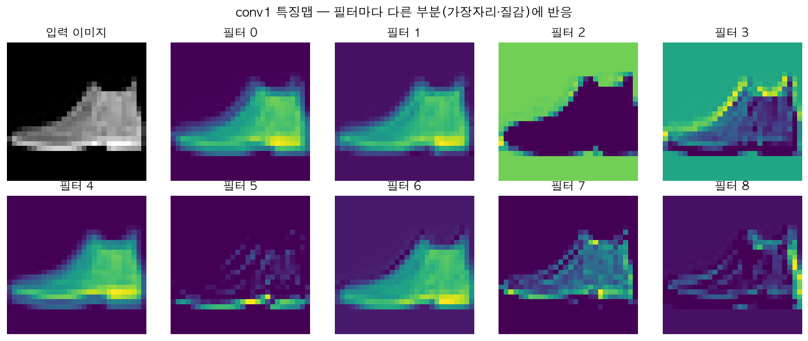

FashionMNIST(28×28)로 Conv 2겹 + Pooling 구조를 학습 → **test acc 0.87**(2 epoch, 개념 확인용). 첫 Conv 층의 특징맵을 보면 **필터마다 다른 부분(가장자리·질감)** 에 반응 — Conv는 한 필터를 이미지 전체에 **공유**해 위치와 무관하게 같은 특징을 잡는다(FC와의 결정적 차이).

### 5.2 ⭐ 전이학습 — 여러 백본 비교 (2-5)
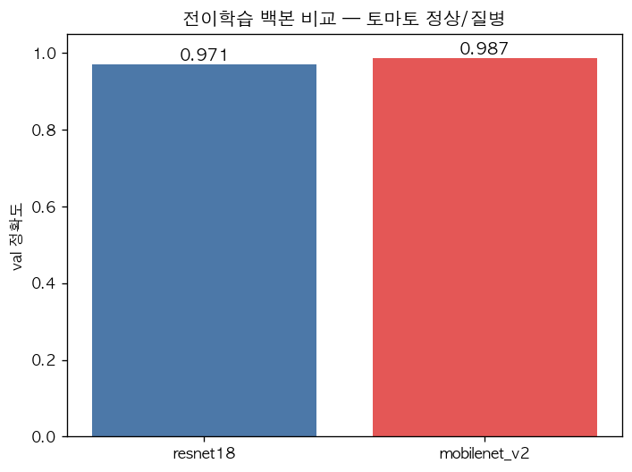

ImageNet 사전학습 백본을 **freeze(특징 추출기로 재사용)** 하고 마지막 분류기(head)만 토마토 **3클래스**로 교체·학습. 적은 데이터(train 316장)로도 고성능.

| 백본 | val 정확도(3분류) |
|---|---|
| ResNet18 | 0.938 |
| MobileNet V2 | 0.938 |

→ "여러 개 비교 후 선정"은 Phase 1(RF/XGB 비교)과 같은 태도. 두 모델 모두 `models/tomato_{resnet18,mobilenet_v2}.pt`로 저장(2-6·2-10에서 재사용). 후속 단계는 Grad-CAM 호환을 위해 ResNet18 사용.

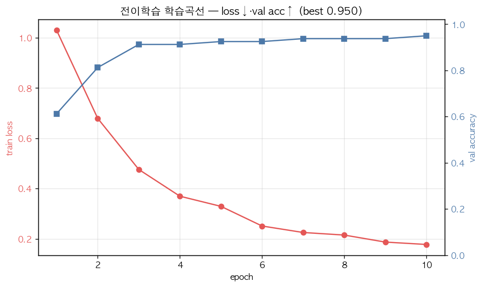

학습이 건강하게 진행됐는지 epoch별 곡선으로 확인 — **train loss는 단조 감소(1.03→0.18), val accuracy는 0.95로 수렴**(발산·과적합 징후 없음). 보조 시각화는 `src/dl/eda_viz.py`로 재현.

### 5.3 ⭐ Grad-CAM — 설명가능 AI (2-6)


마지막 conv 블록(`layer4`)의 활성화 × (예측 클래스에 대한) 기울기 → 가중합 → **히트맵**. 붉은 영역이 모델의 판단 근거다. backbone이 freeze라 grad가 흐르도록 **입력에 `requires_grad`를 켜는** 처리가 핵심. 정확도 숫자 너머 **모델의 시선**을 보는 것이 설명가능 AI의 본질 — 오분류 디버깅에 강력. (예시는 잎곰팡이를 정확히 맞힌 케이스로, 히트맵이 잎 중앙 병반부에 집중되는 것을 볼 수 있다.)

> ⚠️ **Grad-CAM 한계:** 비병변 영역(잎맥·배경)에 반응할 수 있고 해상도가 거칠다 → **보조 지표**로만 쓰고 정밀 위치는 YOLO로 보완. (Selvaraju et al., ICCV 2017)

### 5.4 ⭐ YOLO — 병해 잎 위치 검출 (2-11, 고급)


분류(2-5)는 "잎이 화면을 꽉 채운 사진"을 가정하고 **무엇인지만** 답한다. YOLO는 장면에서 **잎을 찾아 박스 + 병종 라벨 + 신뢰도**까지 — "어디에 있는 무엇" 을 더한다.
- **데이터:** 검출은 **바운딩박스 좌표**가 필요 → 원본 라벨 JSON(`points` + 병종 코드)을 YOLO 포맷으로 변환(`prepare_tomato_yolo.py`, **3클래스** normal/leaf_mold/tylcv, train 346·val 87).
- **학습:** 사전학습 **YOLOv8n** 을 토마토 3클래스로 전이학습(40 epoch, MPS) — 2-5 전이학습과 같은 태도.
- **결과:** 검출 표준 지표 **mAP@50 = 0.78**. 박스로 잎 위치를 잡고 잎곰팡이·황화잎말이를 구분 — FN/오검은 분류(2-9)와 같은 실전 과제로 남음.

> 분류·설명(Grad-CAM)·검출이 한 작물(토마토)에서 이어지며 **비전 파트가 "진단 → 근거 → 위치"** 로 완성된다.

### 5.5 ⭐ LSTM — 다변량·다중 시계열 예측 (2-8)
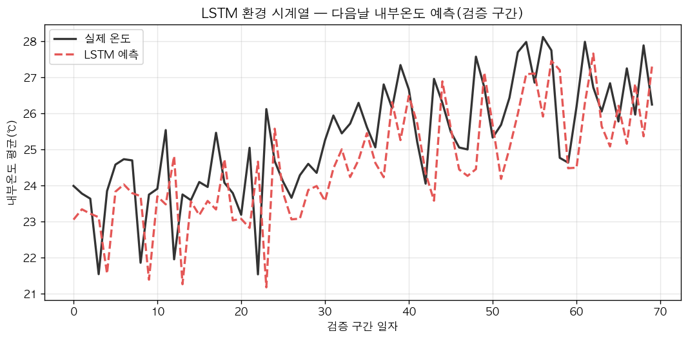

환경 **8변수**(외부온도·일사량·CO₂ 등)를 입력으로, **485개 시계열을 통합 학습**해 다음날 내부온도를 예측(회귀, 평가=MAE).

| 모델 | 검증 MAE |
|---|---|
| persistence baseline(어제값=오늘) | 1.25℃ |
| **다변량 LSTM** | **1.18℃** |

> 🔑 **단변량·시계열 1개로는 baseline(1.13℃)을 못 이겼다.** 그러나 외부온도·일사량·CO₂ 흐름을 함께 보고(다변량) 485개 농가 시계열을 통합하자 **LSTM(1.18℃)이 baseline(1.25℃)을 앞섰다**. "데이터를 끝까지 쓰면 모델이 산다"의 실증 — 그리고 **baseline과 비교해야 진짜 성능이 보인다**(Phase 1 평가 교훈의 연장).

**📈 단년 vs 다년 (데이터 양 효과)** — 환경 데이터를 2022 단년 → 2022~24 다년으로 늘리자 시계열이 **198→485개(2.4배)**, LSTM MAE **1.22→1.18℃**, baseline 대비 우위도 **+0.05→+0.07℃** 로 확대. Phase 1(§6.5)의 "데이터 양 효과"가 시계열에서도 일관되게 재현. (재현: `python src/dl/compare_years_lstm.py`)

## 6. STEP 3 — 평가·강건화
### 6.1 ⭐ 불균형 대응 — 클래스 가중치 (2-7)
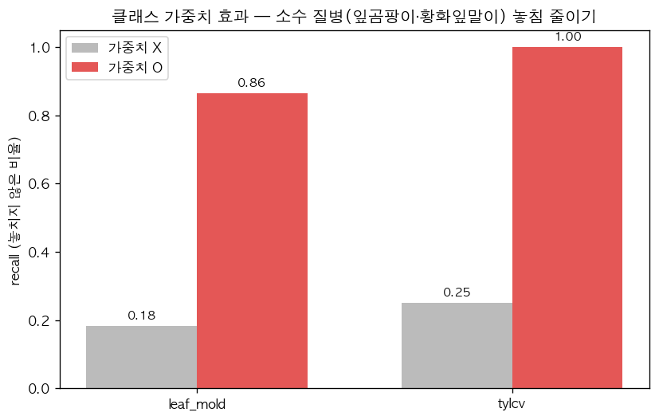

train을 **인위적 불균형**(정상 다수 · 질병 2종 각 1/3)으로 만들고, `CrossEntropyLoss(weight=클래스 역빈도)` 유무로 두 모델 학습 → **소수 질병 recall** 비교.

| 클래스 | 가중치 X | 가중치 O |
|---|---|---|
| leaf_mold(잎곰팡이) | 0.18 | **0.86** |
| tylcv(황화잎말이) | 0.25 | **1.00** |

> 🔑 불균형에선 전체 정확도가 다수클래스(정상)에 속아 높게 나온다. **소수 질병 recall로 봐야** 진짜 성능이 보인다. 가중치를 주면 적은 클래스에 손실을 더 크게 매겨 **놓친 병(FN)을 줄인다**(정상 recall은 다소 희생되는 trade-off) — 농업에선 병 놓침이 가장 위험하므로 합리적 선택.

### 6.2 평가 심화 — 혼동행렬·ROC/AUC·FN 분석 (2-9)
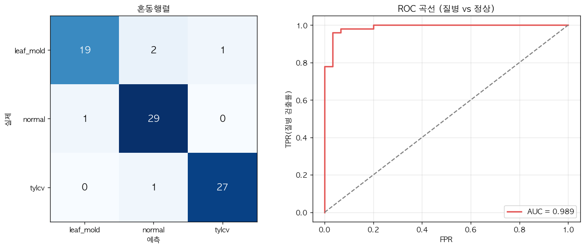


2-5 저장 모델(ResNet18, 3분류)로 val 전체(592장)를 평가 — ① classification report(**acc 0.978 · macro F1 0.978**) ② **3×3 혼동행렬**(잎곰팡이↔황화잎말이 혼동 0건) ③ ROC 곡선·**AUC 0.998**(질병 vs 정상). 정확도 한 숫자보다 **"무엇을 어떻게 틀리나"** 가 실전 가치.
- **FN(질병을 정상으로 놓침)** = 농업에서 가장 위험한 오류 → **질병 392장 중 3건**(질병 recall **0.992**), 모두 질병확률 0.34~0.47로 임계 0.5 *직하*에서 놓침. (원본 잎 사진은 데이터 라이선스상 미게재 → 수치·확률 분포로 정량화)
- 인과 흐름(2-7 → 2-9): 가중치로 질병 recall을 올린 것이 **실제 FN을 줄였나**를 여기서 확인.

## 7. STEP 4 — 산출물 및 실행 방법
### 7.1 추론 파이프라인 (2-10)
- 2-5가 저장한 `models/tomato_resnet18.pt`를 로드 → **사진 1장 → {진단 라벨, 확률, Grad-CAM 히트맵}** 추론 함수로 정리(`src/dl/04_demo.py`의 `predict`).

```bash
python src/dl/04_demo.py --chunk 2-10   # 저장 모델로 1장 추론 시연
```

### 7.2 Streamlit 데모 (2탭)
- **탭1 진단:** 잎 사진 업로드 → 정상·잎곰팡이·황화잎말이 진단 + **Grad-CAM 히트맵**.
- **탭2 검출:** YOLO로 잎 위치 박스 + 병종 라벨 + 신뢰도(conf 슬라이더).

```bash
streamlit run app/phase2_dl.py
```

- 코드: [`app/phase2_dl.py`](../app/phase2_dl.py)
- 🔗 라이브 데모: _(배포 예정)_

### 7.3 단계별 재현
```bash
python src/dl/prepare_tomato.py          # 토마토 zip → ImageFolder (분류용, 최초 1회)
python src/dl/01_basics.py               # STEP 1 기초(2-1·2-2·2-3)
python src/dl/02_core.py                 # STEP 2 핵심(2-4·2-5·2-6·2-8)
python src/dl/03_eval.py                 # STEP 3 평가(2-7·2-9)
python src/dl/04_demo.py                 # STEP 4 데모(2-10·2-12)
python src/dl/prepare_tomato_yolo.py     # 라벨 JSON → YOLO 데이터셋 (검출용, 최초 1회)
python src/dl/05_detect.py               # STEP 5 검출(2-11) YOLO 학습·검출
python src/dl/eda_viz.py                  # (발표용) EDA·학습곡선 그림
```
출력 그림 → `docs/figures/phase2_dl/` · 모델 → `models/`

## 8. 결론 및 제안
- **성과:** ML로 불가능한 **사진 3분류 진단(CNN, val acc 0.978)** 을 전이학습으로 구현하고, **Grad-CAM으로 판단 근거(+한계 직시)**, **YOLO로 병해 잎 위치(mAP@50 0.78)** 까지 — 비전 파트를 "진단 → 근거 → 위치" 로 완성. 불균형(가중치 → 소수 질병 recall 0.2→0.9)·평가 심화(3×3 혼동행렬·AUC 0.998·FN)·**다변량 LSTM(MAE 1.18℃ < baseline 1.25℃, 485개 다년 시계열)**·배포까지 5스텝 완비.
- **한계:**
  - val 규모가 제한적(분류 592장·검출 87장)이라 수치의 분산이 있을 수 있음 — 더 많은 데이터로 재검증 필요.
  - 질병 2종(잎곰팡이·황화잎말이)까지 — 더 많은 병종·다작물 확장은 추가 데이터 필요.
  - YOLO는 잎 1개·박스 1개 기준 학습 — 한 장면에 잎 여러 개·병반 다수 검출은 라벨 보강 필요.
  - LSTM은 1-step(다음날 1개) 예측 — 다단계(향후 N일)·다변량 출력은 미구현.
- **개선 방향:**
  - 데이터 규모 확대(`--per-class` 상향) + 다작물·다병종 확장.
  - YOLO를 **병반(lesion) 단위** 다중 박스 검출로 고도화.
  - LSTM **다단계 예측** + 예측오차 임계값 **이상탐지**(난방고장 등 환경 이상 감지).
- **확장:** 같은 토마토를 Phase 3(LLM)로 관통 → **CNN 진단 + LSTM 예측 + RAG 재배가이드**를 묶어 자연어 처방 제공.

## 📌 배운점 (회고)
- **ML이 못 하던 걸 DL이 한다를 체감.** 정형 데이터로는 손도 못 대던 잎 병해를 사진 1장으로 진단 — 모달리티(정형→이미지)를 바꾼 것이 차별화의 핵심.
- **전이학습은 적은 데이터의 해법.** 수백 장으로도 ImageNet 특징 재사용 덕에 3분류 val acc 0.94. 백본은 "비교 후 선정"이 정석.
- **라벨을 끝까지 쓰자.** 처음엔 정상/질병 2분류로 뭉갰지만, 라벨 코드를 보니 병이 2종 → **3분류**로 확장하니 더 풍부한 진단이 됐다. 데이터가 가진 정보를 흘리지 말 것.
- **정확도보다 무엇을 틀리나.** 불균형에선 전체 정확도가 거짓말을 한다 → **per-class recall·혼동행렬·FN 사례**라야 "질병 놓침"이 보인다. (Phase 1 데이터 누수 교훈의 연장.)
- **설명가능성은 한계까지 봐야.** Grad-CAM은 신뢰를 주지만 비병변 영역에 반응하거나 위치가 거칠다 → **보조 지표**로만, 정밀 위치는 YOLO로.
- **baseline과 비교해야 진짜.** 단변량 LSTM은 persistence baseline을 못 이겼지만, **다변량·다중 시계열**로 확장하니 baseline을 앞섰다. baseline 없는 단일 수치는 과신 위험.
- **분류 vs 검출은 라벨이 가른다.** 분류는 폴더 라벨, 검출은 박스 좌표 → 데이터 가공이 절반. 지표도 정확도가 아니라 박스 IoU 기반 **mAP**.
